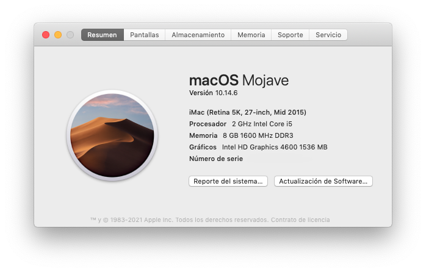
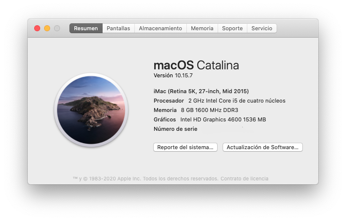

## dell-optiplex-9020m, Dortania Opencore

------

#### CPU - specifications

Intel Core vPro i5-4590T

Intel Graphics 4600

------

#### Mojave

#### Catalina

#### Big Sur

------

## GenSMBIOS

https://github.com/corpnewt/GenSMBIOS

Type:         iMac18,3

Serial:       C02X3MY2J1GJ

Board Serial: C028291014NJ0PGUE

SmUUID:       AE5B3EB6-9214-4F72-AECC-6FCA1703595C

Apple ROM:    70F087B95497

------

## Fix

### AppleALC - Audio

layout-id = 3

### appleALC - macOS 11.2.x

------

### macOS 11.3.x - 12 - up

USB does not work.

I recommend the version macOS 10.14 Mojave

------

## Download image recovery

### Mojave(10.14)

python macrecovery.py -b Mac-7BA5B2DFE22DDD8C -m 00000000000KXPG00 download

### Catalina(10.15)

python macrecovery.py -b Mac-00BE6ED71E35EB86 -m 00000000000000000 download

### Big Sur(11)

python macrecovery.py -b Mac-E43C1C25D4880AD6 -m 00000000000000000 download

### Monterey (12)

python macrecovery.py -b Mac-E43C1C25D4880AD6 -m 00000000000000000 download

------

### Create Folder

com.apple.recovery.boot

### Structure

 EFI

 com.apple.recovery.boot - input dmg recovery

